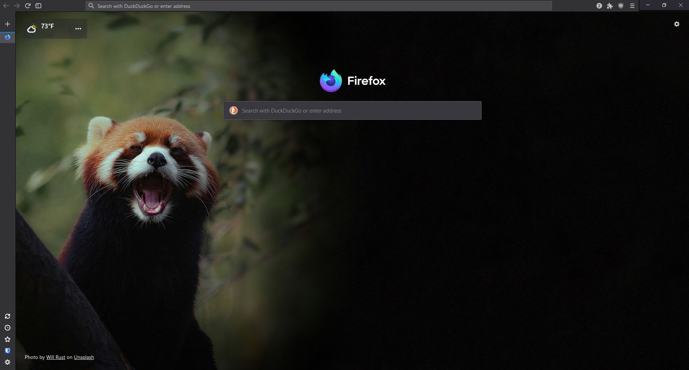

# AuroraFX
AuroraFX is a customChrome.css modification for [zapsCoolPhotonTheme](https://github.com/zapSNH/zapsCoolPhotonTheme).




Description

AuroraFX is a customChrome.css modification for ZapsCoolPhotonTheme, streamlining the Firefox UI with a hidden titlebar and relocated minimize, restore, and close buttons.


Features

- Optimized for [zapsCoolPhotonTheme](https://github.com/zapSNH/zapsCoolPhotonTheme) users
- Reduced titlebar space for increased browsing area
- Customizable (modify CSS to suit your preferences)


Requirements

- Firefox browser
- ZapsCoolPhotonTheme installed
- toolkit.legacyUserProfileCustomizations.stylesheets enabled (about:config)
- svg.context-properties.content.enabled enabled (about:config)


Installation

1. Install [zapsCoolPhotonTheme](https://github.com/zapSNH/zapsCoolPhotonTheme)
2. Clone or download this repository
3. Place customChrome.css file in your Firefox profile folder
    - Typically located at C:\Users\<username>\AppData\Roaming\Mozilla\Firefox\Profiles\<profile_folder>
    - In your profile folder, edit the userChrome.css file, and put this at the bottom:
      ```
      /* Your custom CSS files */
      /* You'll need to create customChrome.css in this folder since it doesn't exist by default */
      @import url(./customChrome.css);
      ```
4. Restart Firefox
5. Enjoy!


Compatibility

- Tested with Firefox Nightly 131.0a1 (2024-08-31) (64-bit)
- Compatible with [zapsCoolPhotonTheme](https://github.com/zapSNH/zapsCoolPhotonTheme)


Credits

- ZapsNH for creating [zapsCoolPhotonTheme](https://github.com/zapSNH/zapsCoolPhotonTheme)
- Mozilla for developing the Firefox browser


Contributing

Pull requests and feature suggestions always welcome!
